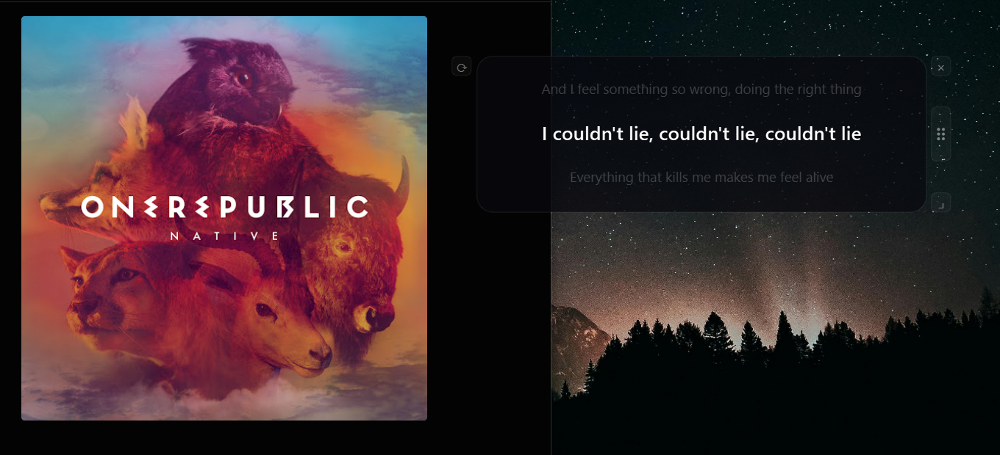
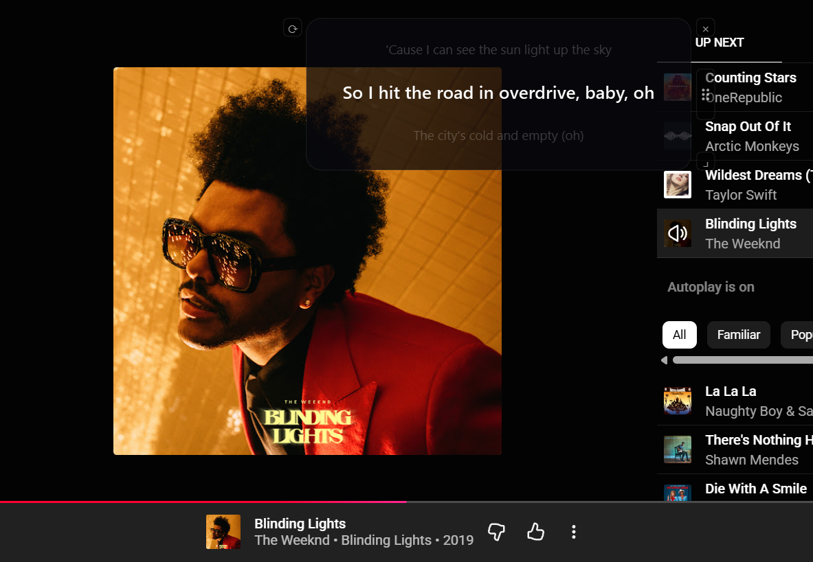

# LyricsLay

Real-time floating lyrics overlay for Windows.

LyricsLay is a lightweight desktop application that automatically detects the music playing on your computer and displays synced lyrics in a floating overlay over any application, game, browser, or video player.

The goal is simple — no browser extensions, no player integrations, no manual searching, no switching windows. Just play music and LyricsLay handles the rest.



---

## Features

- Automatic song recognition using Shazam
- Real-time synced lyrics with YouTube Music-style scroll animation
- Floating always-on-top transparent overlay
- Click-through — mouse clicks pass straight through to the app underneath
- Works with any source — YouTube, YouTube Music, Spotify, VLC, or anything playing through your speakers
- Global hotkeys
- System tray controls
- Local lyrics caching — repeat songs load instantly
- Romanization support for Japanese and Korean lyrics



---

## Supported Platforms

| Platform | Status |
|----------|--------|
| Windows 10 | ✅ Supported |
| Windows 11 | ✅ Supported |
| macOS | Planned |
| Linux | Planned |

Currently Windows-only because the application uses WASAPI loopback audio capture.

---

## Installation

### Option 1 — Download Release (Recommended)

Go to the [Releases](../../releases) section and download:

```
LyricsLay_Setup.exe
```

or portable version:

```
LyricsLay.exe
```

Run the installer or executable. The app will appear in the Windows system tray.

---

### Option 2 — Run From Source

**Requirements:** Python 3.11+, Windows 10/11

```bash
git clone https://github.com/asim63/LyricsLay.git
cd LyricsLay
python -m venv .venv
.venv\Scripts\activate
pip install -r requirements.txt
python main.py
```

---

## Windows SmartScreen Warning

Because LyricsLay is an unsigned open-source application, Windows may show:

```
Windows protected your PC
```

This is normal for newly released indie/open-source software. To continue:

1. Click `More info`
2. Click `Run anyway`

---

## Hotkeys

| Action | Shortcut |
|--------|----------|
| Toggle overlay | `Ctrl + Shift + L` |
| Force reidentify | `Ctrl + Shift + K` |

Both hotkeys are fully customisable — right-click the tray icon → **Settings**.

---

## Overlay Controls

| Control | Action |
|---------|--------|
| `⟳` button (top-left) | Force sync / re-identify current song |
| `×` button (top-right) | Hide overlay |
| `⠿` handle (right side) | Drag to reposition |
| `⌟` handle (bottom-right) | Drag to resize |
| `Alt + drag` | Drag the overlay directly |

---

## System Tray

Right-click the tray icon to:

- Show / hide overlay
- Toggle romanization ON / OFF
- Open settings
- Reset overlay position
- Quit LyricsLay

---

## Romanization

When enabled, lyrics in Japanese and Korean are automatically converted to phonetic Latin script so you can follow along without knowing the script.

| Language | Original | Romanized |
|----------|----------|-----------|
| Japanese | こんにちは | konnichiha |
| Korean | 안녕하세요 | annyeonghaseyo |

Toggle from the tray menu. Takes effect on the next song.

---

## How It Works

LyricsLay continuously listens to system audio using Windows WASAPI loopback.

```
System Audio
    ↓
Song Recognition (Shazam)
    ↓
Lyrics Fetching (LRCLIB → Lyrics.ovh → Genius)
    ↓
Real-Time Overlay Display
```

LRCLIB is tried first — it has time-synced LRC lyrics and succeeds for the majority of popular songs. Lyrics.ovh and Genius are used as fallbacks. Synced lyrics are cached locally after the first fetch.

---

## Tech Stack

| Component | Technology |
|-----------|------------|
| UI Framework | PyQt6 |
| Audio Capture | PyAudioWPatch (WASAPI loopback) |
| Song Recognition | ShazamIO |
| Audio Processing | NumPy |
| Lyrics Fetching | requests + BeautifulSoup |
| Hotkeys | pynput |
| Japanese Romanization | pykakasi |
| Korean Romanization | hangul-romanize |

---

## Project Structure

```
LyricsLay/
│
├── assets/
├── src/
│   ├── core/        # audio, recognizer, cache, settings
│   ├── lyrics/      # fetcher, parser, romanizer
│   └── ui/          # overlay, tray, settings window
│
├── main.py
├── config.py
├── requirements.txt
└── README.md
```

---

## Known Limitations

- Windows-only currently
- Internet connection required for song identification
- Recognition may fail for very obscure or regional tracks
- Lyrics quality depends on third-party databases

---

## Planned Features

- Live caption fallback mode for unrecognised songs
- macOS and Linux support
- Theme and font customisation
- Karaoke-style word-level highlighting
- Auto-updater

---

## Privacy

LyricsLay:

- Does not collect user data
- Does not require an account
- Does not track usage
- Does not upload microphone audio

Only short audio samples required for song identification are sent to Shazam.

---

## Contributing

Pull requests, suggestions, and issue reports are welcome.

---

## Acknowledgements

- [PyQt6](https://pypi.org/project/PyQt6/)
- [ShazamIO](https://github.com/dotX12/ShazamIO)
- [LRCLIB](https://lrclib.net)
- [Lyrics.ovh](https://lyrics.ovh)
- [Genius](https://genius.com)

---

## License

MIT — see [LICENSE](LICENSE)

---

> This entire project is completely vibecoded.

---

**Current Release: v1.0.0-beta · Status: Active Development**